<div align="center">

# :white_check_mark: Checkbox Workflow Action

<!-- gha-description-start -->

Create checkbox-driven automated workflows in GitHub Actions.

<!-- gha-description-end -->

[![Build][badge-build]][build]
[![Apache-2.0][badge-license]][license]
[![code style: prettier][badge-prettier]][prettier]
[![semantic-release: angular][badge-semantic-release]][semantic-release]

</div>

## :rocket: Overview

Checkbox Workflow Action enables **checkbox-driven workflows** where interactive checkboxes in GitHub Issues and Pull Requests trigger and control automated processes.

### Key Features

- **Interactive Task Management**: Create dynamic checklists in comments or issue bodies
- **Automated Triggers**: Checkbox changes automatically trigger GitHub Actions workflows
- **Real-time Updates**: Checkbox states are preserved and synchronized across workflow runs
- **Flexible Templates**: Customize messages and layouts with template variables
- **State Management**: Built-in state tracking prevents duplicate executions
- **Completion Detection**: Simple `all-checked` output for easy workflow completion logic

## :bar_chart: Visual Overview

### How Checkbox Workflows Work

```mermaid
graph TD
    A[User clicks checkbox] -->|GitHub Event| B[issue_comment.edited]
    B --> C{👁️ Detection Mode}
    C -->|State Changed| D[Execute Tasks]
    C -->|No Change| E[Skip]
    D --> F[Update State]
    F --> G[Next User Action]

    H[PR/Issue Created] -->|GitHub Event| I[🔧 Configuration Mode]
    I --> J[Create Checkboxes]
    J --> K[Store Initial State]
```



### Workflow Execution Flow


## :dart: Core Concepts

### Operating Modes

The action operates in two distinct modes, determined by the presence of the `config` parameter:

```mermaid
flowchart TD
    Start([Working with checkboxes?])
    Start --> Q1{Creating new<br/>checkboxes?}
    Q1 -->|Yes| CM[🔧 Configuration Mode<br/>Include 'config' parameter]
    Q1 -->|No| Q2{Monitoring<br/>changes?}
    Q2 -->|Yes| DM[👁️ Detection Mode<br/>Omit 'config' parameter]
    Q2 -->|No| Q3{Resetting<br/>checkboxes?}
    Q3 -->|Yes| CM2[🔧 Configuration Mode<br/>Use 'force-checked']
```



#### :wrench: Configuration Mode

- When: `config` parameter is provided
- Purpose: Create or update checkboxes
- Returns: Always `changed: "false"` (no task execution)
- Use for: Initial setup, forced updates, resetting states

#### :eye: Detection Mode

- When: `config` parameter is omitted
- Purpose: Monitor and react to changes
- Returns: `changed: "true"` when state changes
- Use for: Task execution, conditional workflows

### Which Mode Should I Use?

| Scenario                                 | Mode          | Reason                            |
| ---------------------------------------- | ------------- | --------------------------------- |
| Creating initial checkboxes              | Configuration | Need to define checkbox structure |
| Updating checkbox labels/adding new ones | Configuration | Modifying checkbox definition     |
| Reacting to user clicks                  | Detection     | Monitoring state changes          |
| Resetting all checkboxes                 | Configuration | Use `force-checked: '[]'`         |
| Checking completion status               | Detection     | Read current states               |
| Conditional task execution               | Detection     | React to specific changes         |

## :rocket: Quick Start

> [!IMPORTANT]
> Checkbox workflows use two modes: :wrench: **Configuration Mode** (creates checkboxes) and :eye: **Detection Mode** (responds to changes). Understanding this distinction is crucial for proper implementation.

### Step 1: Create Checkboxes

```yaml
name: 'Create PR Checklist'
on:
  pull_request:
    types: [opened]

permissions:
  pull-requests: write

jobs:
  setup:
    runs-on: ubuntu-latest
    steps:
      - uses: wadackel/checkbox-workflow-action@v1
        with:
          id: pr-checklist
          number: ${{ github.event.pull_request.number }}
          config: |
            [
              {"tests": "Run tests"},
              {"review": "Code review approved"},
              {"deploy": "Deploy to production"}
            ]
          message: |
            ## PR Checklist
            {{body}}
```

### Step 2: Execute Tasks on Checkbox Changes

```yaml
name: 'Handle Checkbox Changes'
on:
  issue_comment:
    types: [edited]

permissions:
  pull-requests: write

jobs:
  execute:
    runs-on: ubuntu-latest
    steps:
      - name: Detect changes
        id: tasks
        uses: wadackel/checkbox-workflow-action@v1
        with:
          id: pr-checklist
          number: ${{ github.event.issue.number }}
          # No config parameter = Detection Mode

      - name: Run tests
        if: ${{ steps.tasks.outputs.changed == 'true' && fromJSON(steps.tasks.outputs.state).tests }}
        run: echo "Running test suite..."

      - name: Deploy
        if: ${{ steps.tasks.outputs.changed == 'true' && fromJSON(steps.tasks.outputs.state).deploy }}
        run: echo "Deploying to production..."
```

When a PR opens, checkboxes appear in a comment. When users click them, your automation executes.

> [!NOTE]
> Make sure your workflows have the required permissions (`issues: write`, `pull-requests: write`) and trigger on the correct events (`issue_comment: [edited]` for Detection Mode).

## :bulb: Common Use Cases

<details>
<summary>📝 Create a deployment checklist for PRs</summary>

You need **Configuration Mode** to create checkboxes when PRs open:

```yaml
name: 'PR Deployment Checklist'
on:
  pull_request:
    types: [opened]

permissions:
  pull-requests: write

jobs:
  create-checklist:
    runs-on: ubuntu-latest
    steps:
      - uses: wadackel/checkbox-workflow-action@v1
        with:
          id: deployment-checklist
          number: ${{ github.event.pull_request.number }}
          config: |
            [
              {"tests": "All tests passing"},
              {"security": "Security review completed"},
              {"staging": "Deployed to staging"},
              {"approval": "Product owner approved"},
              {"deploy": "Deploy to production"}
            ]
          message: |
            ## 🚀 Deployment Checklist
            Please complete all tasks before merging:
            {{body}}
```

</details>

<details>
<summary>⚡ Execute tasks when checkboxes are clicked</summary>

You need **Detection Mode** to monitor checkbox changes:

```yaml
name: 'Execute Deployment Tasks'
on:
  issue_comment:
    types: [edited]

permissions:
  pull-requests: write

jobs:
  handle-checkbox-clicks:
    runs-on: ubuntu-latest
    steps:
      - name: Detect changes
        id: checklist
        uses: wadackel/checkbox-workflow-action@v1
        with:
          id: deployment-checklist
          number: ${{ github.event.issue.number }}
          # No config = Detection Mode

      - name: Deploy to staging
        if: |
          steps.checklist.outputs.changed == 'true' && 
          fromJSON(steps.checklist.outputs.state).staging
        run: |
          echo "Deploying to staging environment..."
          # Your deployment script here

      - name: Deploy to production
        if: |
          steps.checklist.outputs.changed == 'true' && 
          steps.checklist.outputs.all-checked == 'true'
        run: |
          echo "All checks passed - deploying to production!"
          # Your production deployment
```

</details>

<details>
<summary>🔄 Reset checkboxes after completion</summary>

You need **Configuration Mode** with `force-checked`:

```yaml
name: 'Reset Checklist'
on:
  pull_request:
    types: [closed]

permissions:
  pull-requests: write

jobs:
  reset-checkboxes:
    runs-on: ubuntu-latest
    steps:
      - uses: wadackel/checkbox-workflow-action@v1
        with:
          id: deployment-checklist
          number: ${{ github.event.pull_request.number }}
          force-checked: '[]' # Uncheck all boxes
          message: |
            ## ✅ Deployment Complete

            All tasks have been completed and reset.
            {{body}}
```

</details>

<details>
<summary>📊 Check task status from another workflow</summary>

You need **Detection Mode** to read current state:

```yaml
name: 'Monitor Deployment Status'
on:
  workflow_dispatch:
  schedule:
    - cron: '*/15 * * * *' # Every 15 minutes

jobs:
  check-status:
    runs-on: ubuntu-latest
    steps:
      - name: Get checklist status
        id: status
        uses: wadackel/checkbox-workflow-action@v1
        with:
          id: deployment-checklist
          number: 123 # Your PR number
          # No config = Detection Mode

      - name: Check if deployment ready
        if: steps.status.outputs.all-checked == 'true'
        run: |
          echo "All deployment tasks completed!"
          # Trigger deployment or notifications

      - name: Report incomplete tasks
        if: steps.status.outputs.all-checked == 'false'
        run: |
          echo "Current state: ${{ steps.status.outputs.state }}"
          # Send reminders or status updates
```

</details>

<details>
<summary>🏢 Coordinate multi-team approvals</summary>

Create separate checklists for each team:

```yaml
name: 'Multi-Team Approval'
on:
  pull_request:
    types: [opened]

jobs:
  setup-approvals:
    runs-on: ubuntu-latest
    steps:
      # Security team checklist
      - uses: wadackel/checkbox-workflow-action@v1
        with:
          id: security-approval
          number: ${{ github.event.pull_request.number }}
          config: |
            [
              {"vulnerability-scan": "No vulnerabilities found"},
              {"code-review": "Security code review completed"},
              {"approved": "Security team approved"}
            ]

      # QA team checklist
      - uses: wadackel/checkbox-workflow-action@v1
        with:
          id: qa-approval
          number: ${{ github.event.pull_request.number }}
          config: |
            [
              {"functional-tests": "All functional tests passed"},
              {"regression-tests": "No regressions found"},
              {"approved": "QA team approved"}
            ]
```

Then monitor both checklists:

```yaml
name: 'Check All Approvals'
on:
  issue_comment:
    types: [edited]

jobs:
  check-approvals:
    runs-on: ubuntu-latest
    steps:
      - name: Check security approval
        id: security
        uses: wadackel/checkbox-workflow-action@v1
        with:
          id: security-approval
          number: ${{ github.event.issue.number }}

      - name: Check QA approval
        id: qa
        uses: wadackel/checkbox-workflow-action@v1
        with:
          id: qa-approval
          number: ${{ github.event.issue.number }}

      - name: Deploy if all approved
        if: |
          steps.security.outputs.all-checked == 'true' &&
          steps.qa.outputs.all-checked == 'true'
        run: echo "All teams approved - ready to deploy!"
```

</details>

## :arrows_counterclockwise: Workflow Patterns

### Common Implementation Patterns

Most implementations use both modes in separate workflows:

**1. Setup Workflow (Configuration Mode)**

```yaml
# Triggered when PR is opened
on:
  pull_request:
    types: [opened]

jobs:
  setup:
    steps:
      - uses: wadackel/checkbox-workflow-action@v1
        with:
          config: |
            [{"task1": "First task"}, {"task2": "Second task"}]
          # This creates the initial checkboxes
```

**2. Execution Workflow (Detection Mode)**

```yaml
# Triggered when checkboxes are modified
on:
  issue_comment:
    types: [edited]

jobs:
  execute:
    steps:
      - id: detect
        uses: wadackel/checkbox-workflow-action@v1
        with:
          id: same-id-as-setup
          # No config = Detection Mode

      - if: ${{ steps.detect.outputs.changed == 'true' }}
        run: echo "Execute tasks based on changes"
```

## :open_book: Usage Examples

### Basic Checkbox Creation

Create a simple checklist comment:

```yaml
- uses: wadackel/checkbox-workflow-action@v1
  with:
    id: my-checklist
    number: ${{ github.event.pull_request.number }}
    message: |
      ## Code Review Checklist

      {{body}}
    config: |
      [
        {"security-scan": "Security vulnerability scan"},
        {"performance-check": "Performance regression check"},
        {"accessibility": "Accessibility compliance verified"},
        {"stakeholder-review": "Product owner approval"}
      ]
```

### Working with Issue Body

Add progress tracking to existing issues by appending checkboxes to the issue body:

```yaml
- uses: wadackel/checkbox-workflow-action@v1
  with:
    id: issue-progress
    number: ${{ github.event.issue.number }}
    body: true # Update issue body instead of creating comment
    message: |
      {{body}}

      ---
      ## :clipboard: Progress Tracking

      {{body}}
    config: |
      [
        {"investigation": "Root cause identified"},
        {"fix-implemented": "Fix implemented and tested"},
        {"code-review": "Code review completed"},
        {"deployed": "Fix deployed to production"},
        {"verified": "Issue resolution verified"}
      ]
```

**Before** (Original issue body):

```markdown
# Bug: Application crashes on login

## Description

Users are experiencing crashes when attempting to log in...

## Steps to Reproduce

1. Navigate to login page
2. Enter credentials
3. Click login button

## Expected Behavior

User should be logged in successfully
```

**After** (With progress tracking):

```markdown
# Bug: Application crashes on login

## Description

Users are experiencing crashes when attempting to log in...

## Steps to Reproduce

1. Navigate to login page
2. Enter credentials
3. Click login button

## Expected Behavior

User should be logged in successfully

---

## :clipboard: Progress Tracking

- [ ] Root cause identified
- [ ] Fix implemented and tested
- [ ] Code review completed
- [ ] Fix deployed to production
- [ ] Issue resolution verified
```

### Force Checkbox States

You can programmatically check/uncheck boxes:

```yaml
# Check specific boxes
- uses: wadackel/checkbox-workflow-action@v1
  with:
    id: my-tasks
    number: ${{ github.event.issue.number }}
    force-checked: '["security-scan", "performance-check"]' # Force these to be checked

# Clear all checkboxes after task completion
- uses: wadackel/checkbox-workflow-action@v1
  with:
    id: my-tasks
    number: ${{ github.event.issue.number }}
    force-checked: '[]' # Uncheck all boxes
```

### Completion Actions

Execute final actions when all checkboxes are completed:

```yaml
- name: Check task completion
  id: tasks
  uses: wadackel/checkbox-workflow-action@v1
  with:
    id: release-tasks
    number: ${{ github.event.issue.number }}

# Simple completion check using the all-checked output
- name: Release to Production
  if: ${{ steps.tasks.outputs.all-checked == 'true' }}
  run: |
    echo "🚀 All release tasks completed - deploying to production"
    # Deploy to production, close issue, send notifications
```

### Complex Configuration

Checkboxes can have additional metadata:

```yaml
config: |
  [
    {
      "frontend-tests": {
        "label": "Run frontend tests",
        "description": "Jest and React Testing Library",
        "priority": "high"
      }
    },
    {
      "backend-tests": {
        "label": "Run backend tests", 
        "description": "Unit and integration tests"
      }
    }
  ]
```

## :wrench: Implementation Examples

<details>
<summary>1. Database Migration Workflow</summary>

Critical production operations requiring manual approval:

```yaml
config: |
  [
    {"backup-verified": "Database backup completed and verified"},
    {"migration-tested": "Migration tested on staging environment"},
    {"dba-approval": "Database administrator approval"},
    {"maintenance-window": "Maintenance window scheduled"},
    {"execute-migration": "Execute production migration"},
    {"rollback-tested": "Rollback procedure verified"}
  ]

# Automatic completion action when all steps are done
- name: Migration Complete
  if: ${{ steps.migration-tasks.outputs.all-checked == 'true' }}
  run: |
    echo "✅ Database migration workflow completed successfully"
    # Send notifications, close issue, update documentation
```

</details>

<details>
<summary>2. Security Incident Response</summary>

Time-sensitive operational procedures:

```yaml
config: |
  [
    {"incident-assessed": "Security incident scope assessed"},
    {"team-notified": "Security team and stakeholders notified"},
    {"containment": "Threat contained and systems isolated"},
    {"evidence-preserved": "Forensic evidence preserved"},
    {"patch-deployed": "Security patch deployed"},
    {"systems-verified": "All systems verified secure"}
  ]
```

</details>

<details>
<summary>3. Feature Flag Management</summary>

Gradual rollout control with approval gates:

```yaml
config: |
  [
    {"config-reviewed": "Feature flag configuration reviewed"},
    {"monitoring-setup": "Monitoring and alerts configured"},
    {"enable-internal": "Enable for internal users (5%)"},
    {"enable-beta": "Enable for beta users (25%)"},
    {"enable-general": "Enable for general availability (100%)"}
  ]
```

</details>

<details>
<summary>4. Compliance Audit Trail</summary>

Regulatory requirement tracking:

```yaml
config: |
  [
    {"data-classification": "Data classification completed"},
    {"privacy-review": "Privacy impact assessment"},
    {"security-controls": "Security controls validated"},
    {"compliance-check": "Regulatory compliance verified"},
    {"documentation": "Audit documentation complete"},
    {"sign-off": "Compliance officer sign-off"}
  ]
```

</details>

<details>
<summary>5. Infrastructure Provisioning</summary>

Cloud resource management with cost controls:

```yaml
config: |
  [
    {"cost-estimated": "Infrastructure cost estimated"},
    {"security-baseline": "Security baseline configuration"},
    {"network-config": "Network and firewall rules"},
    {"monitoring-setup": "Logging and monitoring configured"},
    {"provision": "Provision infrastructure resources"},
    {"validation": "Infrastructure health validated"}
  ]
```

</details>

## :clipboard: Advanced Features

### Workflow Performance Optimization

The action automatically adds a managed prefix to all generated comments to enable efficient workflow filtering:

```mermaid
graph LR
    A[All Comments] -->|Without Filter| B[100 workflows triggered]
    A -->|With managed prefix| C[Only relevant workflows]
    B --> D[❌ High cost & slow]
    C --> E[✅ Optimized & fast]

    style D fill:#f96,stroke:#333,stroke-width:2px
    style E fill:#9f6,stroke:#333,stroke-width:2px
```



```yaml
# The action automatically adds this prefix to all messages:
<!-- checkbox-workflow-action:managed -->
# Your message content here...
```

Use this prefix to optimize your workflow triggers and prevent unnecessary executions:

```yaml
# ✅ Optimized: Only trigger on managed comments
on:
  issue_comment:
    types: [created, edited]

jobs:
  your-job:
    # Only run on comments managed by this action
    if: startsWith(github.event.comment.body, '<!-- checkbox-workflow-action:managed -->')
    steps:
      # Your workflow steps...
```

Benefits of workflow filtering:

- Reduced API usage - Workflows only run when relevant
- Faster execution - Skip unnecessary workflow runs
- Cost optimization - Lower GitHub Actions usage
- Cleaner workflow logs - Less noise from unrelated comments

### State Detection and Workflow Control

> [!WARNING]
> Always check `outputs.changed == 'true'` before executing tasks to prevent unnecessary workflow runs and potential duplicate executions.

The action provides detailed state information to control your workflows:

```yaml
- id: tasks
  uses: wadackel/checkbox-workflow-action@v1
  with:
    id: my-tasks
    number: ${{ github.event.issue.number }}

# Only proceed if checkboxes actually changed
- name: Check if we should continue
  if: ${{ steps.tasks.outputs.changed == 'true' }}
  run: echo "Checkbox state changed, proceeding with tasks"

# Access individual checkbox states
- name: Handle specific checkbox
  if: ${{ fromJSON(steps.tasks.outputs.state).deploy == true }}
  run: echo "Deploy checkbox is checked"

# Only execute tasks for checkboxes that changed (prevents duplicate executions)
- name: Handle checkbox that just changed
  if: ${{ steps.tasks.outputs.changed == 'true' && contains(fromJSON(steps.tasks.outputs.changes), 'deploy') && fromJSON(steps.tasks.outputs.state).deploy }}
  run: echo "Deploy checkbox was just checked - executing deployment"

# Check if all checkboxes are completed using the convenient all-checked output
- name: All tasks completed
  if: ${{ steps.tasks.outputs.all-checked == 'true' }}
  run: echo "All checkboxes are checked - ready for final action"

# Get the comment ID for further updates
- name: Update comment
  run: |
    echo "Comment ID: ${{ steps.tasks.outputs.comment-id }}"
```

### Required Permissions

> [!IMPORTANT]
> Without proper permissions, the action will fail with "Resource not accessible by integration" errors.

All workflows using this action need specific GitHub permissions to function properly:

```yaml
permissions:
  issues: write # Create and update issue comments/body
  pull-requests: write # Create and update PR comments/body
  contents: read # Access repository contents (if needed)
```

**Permission Details:**

- `issues: write` - Required for reading/writing issue comments and body content
- `pull-requests: write` - Required for reading/writing PR comments and body content
- `contents: read` - Only needed if your workflow checks out code or accesses files

### Template Variables

Customize your messages with template variables:

```yaml
message: |
  # 🚀 Production Release Checklist - PR #${{ github.event.pull_request.number }}

  **Release Manager:** @${{ github.event.pull_request.user.login }}
  **Target Environment:** Production
  **Scheduled Deployment:** {{ steps.deployment.outputs.scheduled_time }}

  {{body}}

  ---
  ⚠️ **All checkboxes must be completed before production deployment**
```

### Preventing Duplicate Executions

The action provides multiple ways to prevent duplicate task execution:

**Basic State Change Detection:**

- `outputs.changed` is only `"true"` when checkbox states actually change
- Use this in your `if` conditions to avoid unnecessary work

**Advanced Changed State Detection:**

- `outputs.changes` contains only the checkbox keys that actually changed state
- Use `contains(fromJSON(steps.tasks.outputs.changes), 'key-name')` to check if a specific checkbox changed
- Combine with `checked` check for precise control: both changed AND currently checked

**Recommended Pattern:**

```yaml
# Only execute when checkbox was just checked (not on every workflow run)
if: ${{ steps.tasks.outputs.changed == 'true' && contains(fromJSON(steps.tasks.outputs.changes), 'deploy') && fromJSON(steps.tasks.outputs.state).deploy }}
```

This ensures tasks only run when:

1. State actually changed (`continue == 'true'`)
2. The specific checkbox changed (`contains(changes, 'deploy')`)
3. The checkbox is currently checked (`checked.deploy == true`)

**State Tracking:**

- Metadata is embedded in comments to track previous states
- Each workflow run compares current state with previous state to detect changes

## :inbox_tray: Inputs

<!-- gha-inputs-start -->

| ID              | Required           | Default               | Description                                                                                       |
| :-------------- | :----------------- | :-------------------- | :------------------------------------------------------------------------------------------------ |
| `id`            | :white_check_mark: | n/a                   | Unique identifier for the checkbox group                                                          |
| `number`        | :white_check_mark: | n/a                   | Issue or Pull Request number                                                                      |
| `message`       |                    | n/a                   | Message template string to display in Issue/PR comments. Checkboxes are expanded with `{{body}}`. |
| `config`        |                    | n/a                   | JSON5 string for checkbox configuration                                                           |
| `force-checked` |                    | n/a                   | JSON string array of checkbox keys to force as checked                                            |
| `body`          |                    | `false`               | If true, updates Issue/PR body instead of creating comment                                        |
| `token`         |                    | `${{ github.token }}` | GitHub token for API access                                                                       |

<!-- gha-inputs-end -->

## :outbox_tray: Outputs

<!-- gha-outputs-start -->

| ID            | Description                                                              |
| :------------ | :----------------------------------------------------------------------- |
| `retrieved`   | Whether checkbox state was successfully retrieved (`"true"` / `"false"`) |
| `changed`     | Whether checkbox state changed from previous (`"true"` / `"false"`)      |
| `state`       | Current checkbox state (JSON object)                                     |
| `changes`     | Array of checkbox keys that changed (JSON array)                         |
| `all-checked` | Whether all checkboxes are checked (`"true"` / `"false"`)                |
| `comment-id`  | ID of created/updated comment                                            |

<!-- gha-outputs-end -->

## :mag: Troubleshooting

### Debug Flowchart


### Common Issues

> [!TIP]
> Use the debug flowchart above to systematically identify and resolve issues with your checkbox workflows.

**Workflow runs but nothing happens:**
Always check for state changes using the `changed` output:

```yaml
# ✅ Correct pattern
- if: ${{ steps.tasks.outputs.changed == 'true' && fromJSON(steps.tasks.outputs.state).deploy }}
  run: echo "Deploy checkbox was checked"
```

**Permission denied errors:**
Ensure your workflow has the required permissions:

```yaml
permissions:
  issues: write
  pull-requests: write
```

**Checkbox changes not detected:**
Make sure your workflow triggers on the correct event:

```yaml
on:
  issue_comment:
    types: [edited]
```

**Which mode should I use?**

- :wrench: Configuration Mode (with `config` parameter): Create/update checkboxes
- :eye: Detection Mode (without `config` parameter): React to checkbox changes

### Best Practices

> [!NOTE]
> Following these best practices will help ensure reliable and efficient checkbox workflows.

1. Always use `outputs.changed` checks to prevent unnecessary executions
2. Set proper permissions (`issues: write`, `pull-requests: write`)
3. Use meaningful IDs to avoid conflicts between checkbox groups
4. Add concurrency control for production workflows
5. Use `all-checked` output for completion logic

## :books: Contributing

See [CONTRIBUTING.md](CONTRIBUTING.md) for development setup, E2E testing guide, and contribution guidelines.

## :memo: License

See [LICENSE][license].

Copyright 2025 wadackel.

[badge-build]: https://img.shields.io/github/actions/workflow/status/wadackel/checkbox-workflow-action/ci.yaml?style=flat-square
[badge-license]: https://img.shields.io/github/license/wadackel/checkbox-workflow-action?style=flat-square
[badge-prettier]: https://img.shields.io/badge/code_style-prettier-ff69b4.svg?style=flat-square
[badge-semantic-release]: https://img.shields.io/badge/semantic--release-angular-e10079?logo=semantic-release&style=flat-square
[build]: https://github.com/wadackel/checkbox-workflow-action/actions/workflows/ci.yaml
[license]: ./LICENSE
[prettier]: https://github.com/prettier/prettier
[semantic-release]: https://github.com/semantic-release/semantic-release
